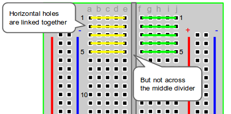
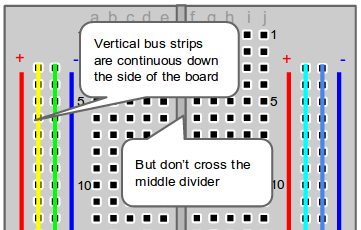
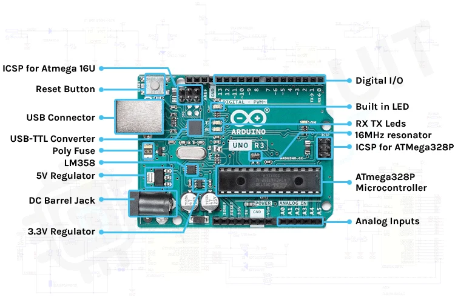
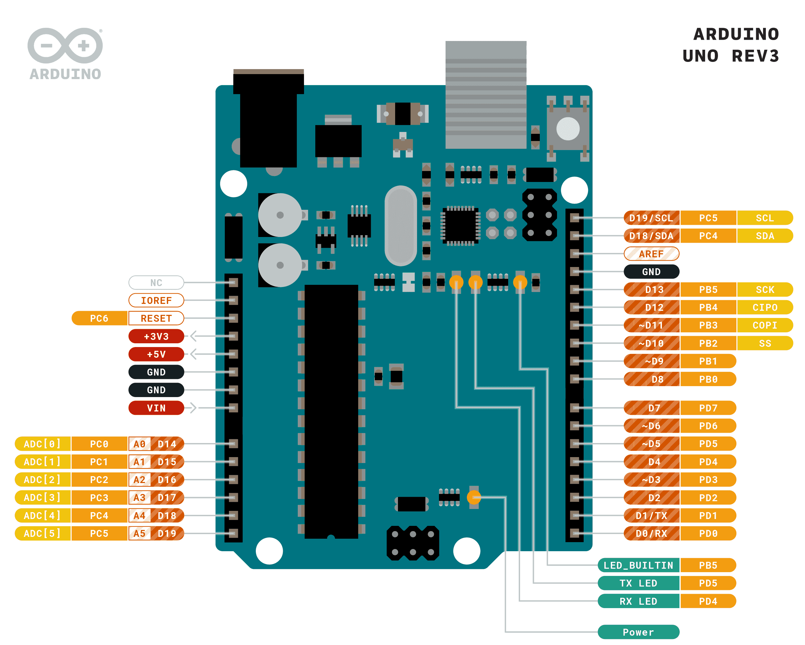
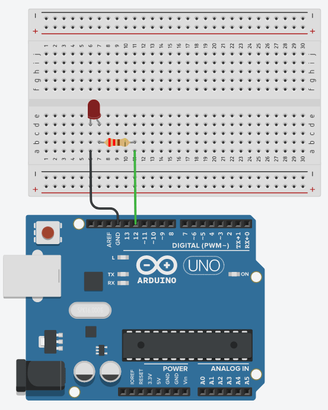
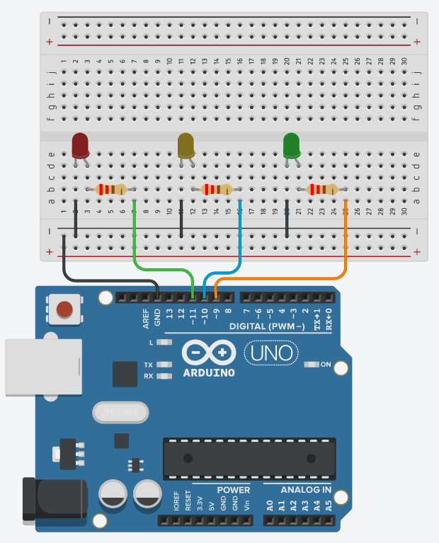

# Week 1 — Outputs and Programming Basics

**Goal:** Make the Arduino do something.

**Takeaway:** Software can control hardware.

---

## Intro to Electronics

### What is an electric circuit?

A circuit is a closed loop that lets electric current flow from a power source, through components, and back again.

Think of it like water in a pipe:

- **Voltage** (measured in volts, V) is the pressure pushing the current.
- **Current** (measured in amps, A) is how much is flowing.
- **Resistance** (measured in ohms, Ω) is how much the pipe restricts the flow.

These three are related by **Ohm's Law**: `V = I × R`

A circuit needs two things to work:
1. A complete path (no gaps or breaks).
2. A power source (like a battery or the Arduino's 5V pin).

If the path is broken — by a switch, a disconnected wire, or a component in the wrong place — no current flows and nothing works. That's an **open circuit**. If current finds a path with almost no resistance (e.g. a wire directly from + to −), that's a **short circuit** — dangerous, as it can overheat or damage components.

Common components:
- **LED** — a diode that emits light when current flows through it (only works in one direction).
- **Resistor** — limits current to protect components like LEDs.
- **Breadboard** — a reusable board for building circuits without soldering.

### How a breadboard works



Each short row of 5 holes is connected internally. Push two components into the same row and they share a connection — no soldering needed.



The two long rails along the edges (marked + and −) run the full length of the board and are used for power and ground.

### What is digital logic?

Electronics can represent information using two states: **HIGH** and **LOW** (also written as 1 and 0, or ON and OFF).

This is called **digital** because it uses discrete values, not a continuous range. Your Arduino operates at 5V logic:

| State | Voltage |
|-------|---------|
| HIGH  | ~5V     |
| LOW   | 0V (GND)|

A **digital output** pin on the Arduino can be switched between HIGH and LOW by your program. Connect an LED to one and you can turn it on and off in software.

**Analog** signals, by contrast, can take any value in a range (like the volume knob on a stereo). We'll look at reading analog values in Week 2.

---

## What is Arduino?

Arduino is a platform combining:
- A **microcontroller** — a small computer on a chip that runs your program.
- A set of **input/output pins** — connections to the physical world.
- The **Arduino IDE** — software on your computer for writing and uploading code.

The core loop: **Inputs → Processing → Outputs**

Your program reads the world (sensors, buttons), decides what to do (your code), and acts on it (LEDs, motors, sounds).

### Board tour (Arduino Uno)



| Part | Purpose |
|------|---------|
| USB port | Power from computer; upload programs |
| Power jack | External power supply |
| `RESET` button | Restart the program |
| Digital pins 0-13 | Read or write HIGH/LOW signals |
| Analog pins A0-A5 | Read varying voltages (0-5V) |
| `5V` and `3.3V` pins | Provide power to components |
| `GND` pins | Ground (the − reference for all voltages) |
| `VIN` pin | Input voltage from external supply |
| Microcontroller (ATmega328P) | The brain — runs your program |
| Power LED | Lit when the board has power |
| Pin 13 LED | Built-in LED, useful for quick tests |

**Pin reference:**



---

## Arduino IDE

The Arduino IDE is where you write your **sketch** (Arduino's term for a program).

Every sketch has two required functions:

- `setup()` — runs once when the board powers on or resets. Use it to configure pins.
- `loop()` — runs over and over, forever, after `setup()` finishes. Your main logic goes here.

Under the hood, the Arduino runtime ties them together like this:

```cpp
// Pseudocode — not something you write, just how it works
int main() {
    setup();
    while (true) {
        loop();
    }
}
```

To upload: connect via USB, select your board and port, click **Upload**. The IDE **compiles** your sketch first — translating the high-level code you wrote into instructions the ATmega328P's CPU can execute directly: moving data around, comparing values, toggling pins. Your sketch is a convenient shorthand for all of that — and "all of that" is ultimately billions of tiny switches called transistors, flipping on and off inside the chip.

> **For the curious:** You didn't write `#include` anything, yet `digitalWrite` and `delay` just work. The IDE automatically prepends `#include <Arduino.h>` before compiling your sketch. That header declares all the standard Arduino functions and constants — it lives in your Arduino installation under `cores/arduino/Arduino.h` and is ordinary C++ you can open and read.

---

## Activity 1 — Blink

The "Hello, World" of hardware. Make the built-in LED on pin 13 blink.

Sketch: [blink/blink.ino](blink/blink.ino)

**Try it:**
- Change the delay values. What's the fastest blink you can see?
- What happens if the two delays are different?

---

## Activity 2 — External LED

### Step 1 — A static circuit

Wire an LED between the Arduino's 5V pin and GND with a 220Ω resistor in series. It lights up. Pull the GND wire out and it goes off — you've just made a manual switch by opening and closing the circuit.

**Why the resistor?** Without it, too much current flows and the LED burns out. 220Ω limits it to a safe ~20mA.

### Step 2 — Let the Arduino be the switch



Move the LED's power connection from the 5V pin to digital pin 12. Now `digitalWrite(12, HIGH)` turns it on; `LOW` turns it off.

The Uno's digital pins can safely source about 40mA — enough for an LED. For heavier loads like motors and servos you need a different approach, but that's Week 4 territory.

Sketch: [external_led/external_led.ino](external_led/external_led.ino)

---

## Activity 3 — Multiple LED Patterns



Wire three LEDs — red on pin 11, yellow on pin 10, green on pin 9 — each with a 220Ω resistor to the GND rail. Write a pattern that cycles through them one at a time.

Sketch: [led_pattern/led_pattern.ino](led_pattern/led_pattern.ino)

**Challenge:** Can you make the cycle faster? Can you make one LED blink three times before moving to the next?

---

## Night-light connection

> Today we learned how to control the lamp.

---

## Session pacing (~60 min)

| Time | Section |
|------|---------|
| 0-10 min | Intro to Electronics — circuits, breadboard, digital logic |
| 10-15 min | What is Arduino? — board tour |
| 15-20 min | Arduino IDE — upload a sketch |
| 20-30 min | Activity 1 — Blink |
| 30-45 min | Activity 2 — External LED |
| 45-58 min | Activity 3 — Multiple LED Patterns |
| 58-60 min | Wrap-up |

---

## Key terms

| Term | Meaning |
|------|---------|
| Voltage | Electrical pressure (V) |
| Current | Flow of charge (A) |
| Resistance | Opposition to flow (Ω) |
| HIGH / LOW | Digital states: ~5V / 0V |
| `pinMode()` | Configures a pin as INPUT or OUTPUT |
| `digitalWrite()` | Sets a digital pin HIGH or LOW |
| `delay()` | Pauses the program for a number of milliseconds |
| Sketch | An Arduino program |
