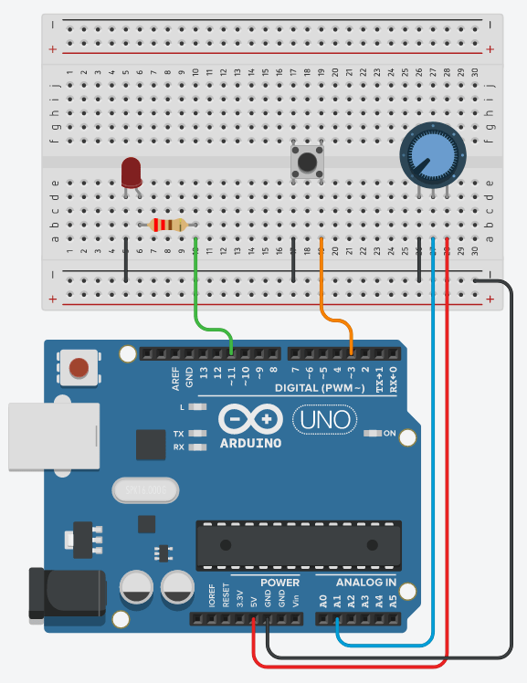

# Week 2 — Inputs and Interaction

**Goal:** Make hardware respond to the world.

**Takeaway:** Hardware can sense the world.

---

## Recap

Last week we used `digitalWrite()` to turn an LED on and off. The Arduino was talking *to* the world.

This week it starts *listening*.

---

## Digital Input — Button

A button is the simplest input: it's either pressed (circuit closed) or not (circuit open).

### Wiring

Connect one leg of the button to **pin 3** and the other to **GND**. Connect an LED (with its resistor) to **pin 11**. No external resistor needed on the button — the Arduino has one built in.



**Why no resistor?** Configuring the pin as `INPUT_PULLUP` activates an internal resistor that holds the pin HIGH. When the button is pressed and connects the pin to GND, it reads LOW. The logic is inverted — pressed = `LOW` — which the sketch accounts for.

Sketch: [button_led/button_led.ino](button_led/button_led.ino)

**Try it:** Hold the button. The LED lights. Release it. The LED goes off.

---

## Analog Input

Digital signals are HIGH or LOW. Analog signals are anything in between — a continuously varying voltage.

The Arduino Uno has **6 analog input pins** (A0–A5). They use a 10-bit **analog-to-digital converter (ADC)**, which maps 0–5V to a number from 0 to 1023.

| Voltage | `analogRead()` value |
|---------|---------------------|
| 0V (GND) | 0 |
| 2.5V | ~511 |
| 5V | 1023 |

### Potentiometer

A potentiometer (pot) is a variable resistor. Turning the knob changes the voltage on the middle (wiper) pin from 0V to 5V.

**Wiring:** outer pins to GND and 5V; middle pin to A1.

Sketch: [pot_read/pot_read.ino](pot_read/pot_read.ino)

Open the **Serial Monitor** (Tools → Serial Monitor, or Ctrl+Shift+M). Turn the pot and watch the numbers change.

### Photoresistor (LDR)

A light-dependent resistor (LDR) changes resistance with light level. Wire it as a **voltage divider** with a 10kΩ resistor:

```
5V ── LDR ── A1 ── 10kΩ ── GND
```

In bright light, the LDR has low resistance → A1 reads high. In darkness, high resistance → A1 reads low. (Or vice versa depending on orientation — check with Serial Monitor.)

---

## Serial Monitor

The Serial Monitor lets your Arduino send messages back to your computer over USB. Invaluable for debugging.

```cpp
Serial.begin(9600);       // Start serial at 9600 baud (in setup).
Serial.println(value);    // Print a value followed by a newline.
Serial.print("Reading: ");// Print without a newline.
```

Make sure the baud rate in the Serial Monitor matches `Serial.begin()`.

---

## Thresholds

Once you can read an analog value, you can make decisions based on it.

```cpp
int lightLevel = analogRead(A1);

if (lightLevel < 400) {
  digitalWrite(11, HIGH);  // Dark: turn LED on.
} else {
  digitalWrite(11, LOW);   // Bright: turn LED off.
}
```

The threshold value (400 here) depends on your sensor and lighting conditions — use the Serial Monitor to find a good value for your environment.

---

## Activity 1 — Button controls LED

Wire a button to pin 3 (other leg to GND) and an LED to pin 11. The LED turns on when the button is held.

Sketch: [button_led/button_led.ino](button_led/button_led.ino)

**Challenge:** Make the button *toggle* the LED (press once to turn on, press again to turn off).

> **Tip — button bounce:** Mechanical buttons don't switch cleanly; a single press can bounce and register as multiple rapid transitions. A single press can then read as two or three, which is especially noticeable with toggle behaviour. The quickest fix is a short `delay(20)` immediately after detecting a press. If your toggle still misfires, increase the delay slightly.

---

## Activity 2 — Pot controls blink speed

Read a potentiometer on A1. Map the value to a blink delay.

Sketch: [pot_blink/pot_blink.ino](pot_blink/pot_blink.ino)

`map(value, fromLow, fromHigh, toLow, toHigh)` rescales a number from one range to another.

**Or:** Wire the LDR instead of a pot and make the LED respond to light level — a preview of the auto_on activity below.

---

## Activity 3 — Auto-on night light

Wire the LDR voltage divider on A1 and an LED on pin 11. Use the Serial Monitor to find your threshold, then the LED turns on automatically when the room goes dark.

Sketch: [auto_on/auto_on.ino](auto_on/auto_on.ino)

**Challenge:** Can you make it turn on only when it gets *very* dark — adjust the threshold.

> **Note:** Right now the LED is fully on or fully off. In Week 3 we'll make brightness track the light level smoothly.

---

## Night-light connection

> Today we built the eyes and controls.

---

## Key terms

| Term | Meaning |
|------|---------|
| `digitalRead()` | Read HIGH or LOW from a digital pin |
| `analogRead()` | Read 0–1023 from an analog pin |
| `INPUT_PULLUP` | Pin mode that activates a built-in resistor, holding the pin HIGH until GND is applied |
| ADC | Analog-to-digital converter |
| Potentiometer | Variable resistor; adjustable voltage divider |
| LDR / photoresistor | Resistor whose value changes with light |
| `Serial.println()` | Send a value to the Serial Monitor |
| `map()` | Rescale a number from one range to another |
| Threshold | A cutoff value used to make a decision |
