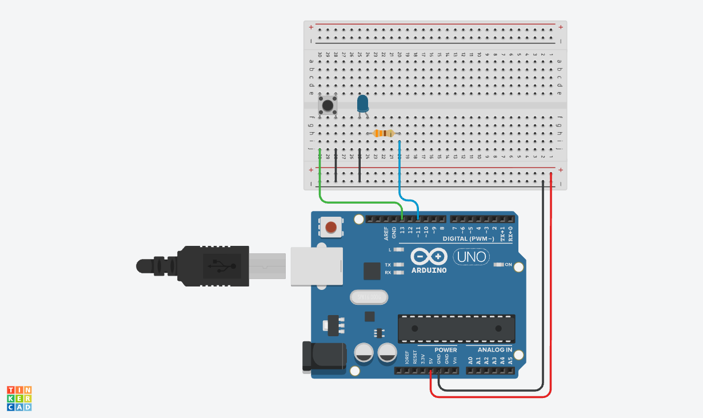
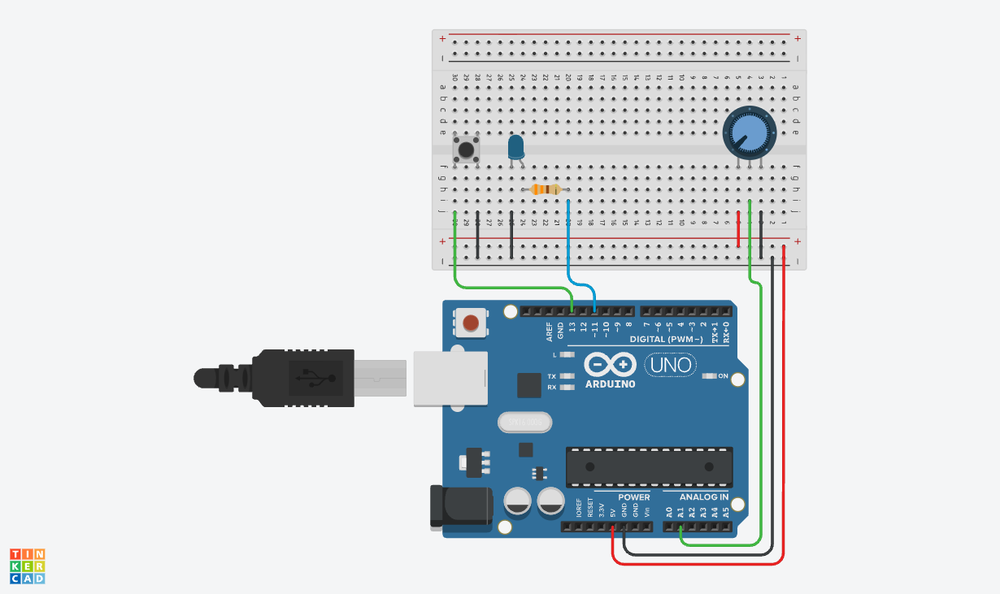
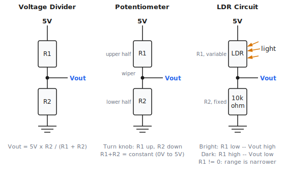

# Week 2 — Inputs and Interaction

**Goal:** Make hardware respond to the world.

**Takeaway:** Hardware can sense the world — and talk back to your computer.

---

## Recap

Last week we used `digitalWrite()` to turn an LED on and off. The Arduino was talking *to* the world.

This week it starts *listening*. But first, there is a type of output we skipped last week — sending data back to the computer over USB. We will use it constantly from here on, so let's build it first.

---

## 1. Talking back to your computer

The Arduino talks to your computer over the same USB cable you use to upload code. This is called **serial communication**.

Start a new sketch and type along: [serial_count/serial_count.ino](serial_count/serial_count.ino)

Upload it. Then open **Serial Monitor** (Tools → Serial Monitor, or Ctrl+Shift+M) — you should see numbers scrolling past. Now switch to **Serial Plotter** (Tools → Serial Plotter) — you should see two lines forming a V shape.

> `Serial.begin(9600)` starts the serial link at 9600 baud — the speed the Arduino and your computer use to talk to each other. The number doesn't matter much; what matters is that the monitor is set to the same value, or the output will be garbled.
>
> `Serial.print()` sends a value without a newline. `Serial.println()` adds one. The plotter expects raw numbers separated by commas — one column per channel.

No wiring needed. The Arduino is just counting. But now you have a tool that shows you live what is happening inside the program.

**Challenge:** Change the `delay()` value. What happens to the slope of the lines in the plotter?

---

## 2. Digital Input — Button

A button is the simplest input: it is either pressed (circuit closed) or not (circuit open).

### Wire it

Connect one leg of the button to **pin 13** and the other to **GND**. Connect an LED (with its resistor) to **pin 11**.



No external resistor on the button — we will handle that in the code.

### Code it

Type along: [button_led/button_led.ino](button_led/button_led.ino)

Upload it. Hold the button — the LED should light. Release it — the LED goes off.

> **Why `INPUT_PULLUP`?** Without any resistor, an unconnected pin floats — it picks up electrical noise and reads randomly. `INPUT_PULLUP` activates an internal resistor that holds the pin HIGH. When you press the button and connect the pin to GND, it reads LOW. This means the logic is *inverted*: pressed = `LOW`. That is why the sketch turns the LED on when `buttonState == LOW`.
>
> **HIGH and LOW** describe the physical voltage on a pin — HIGH is ~5V, LOW is 0V. They do not mean "on" or "off", because whether something activates at HIGH or LOW depends entirely on how you wired it.

Reference sketch: [button_led/button_led.ino](button_led/button_led.ino)

### Challenge — Toggle

Make the button *toggle* the LED: press once to turn it on, press again to turn it off.

Once you have it working, try pressing the button quickly several times. Does the LED always respond the way you expect?

> **What is happening — button bounce:** Mechanical buttons do not switch cleanly. A single press can bounce between HIGH and LOW several times before settling. With toggle logic this is immediately visible: each phantom transition flips the LED an extra time, so it appears not to respond. A short `delay(20)` after detecting the press sleeps through the noise window. A `while (digitalRead(13) == LOW) {}` then waits for the button to be physically released so holding it does not keep toggling. Add another `delay(20)` after the release for the same reason.

Reference sketch: [button_toggle/button_toggle.ino](button_toggle/button_toggle.ino)

---

## 3. Analog Input — Potentiometer

A button is yes or no. The real world is everything in between.

The Arduino Uno has **6 analog input pins** (A0–A5). They use a 10-bit **analog-to-digital converter (ADC)** to measure voltage and turn it into a number.

### Wire it

A potentiometer (pot) is a **variable voltage divider**. It has three pins: two outer pins connected to a fixed resistance, and a middle wiper that slides along it. Turning the knob moves the wiper, changing how the resistance is split — and therefore the voltage at the wiper pin.

**Wiring:** outer pins to GND and 5V; middle (wiper) pin to **A1**.



### Code it

Type along: [pot_read/pot_read.ino](pot_read/pot_read.ino)

Upload it and open the **Serial Plotter**. Turn the pot — you should see the line rise and fall.

> The ADC maps 0–5V to a number from 0 to 1023:
>
> | Voltage | `analogRead()` value |
> |---------|---------------------|
> | 0V (GND) | 0 |
> | 2.5V | ~511 |
> | 5V | 1023 |

Reference sketch: [pot_read/pot_read.ino](pot_read/pot_read.ino)

### Extend — Pot controls blink speed

Now let's use that value to control the LED. The `map()` function rescales a number from one range to another:

```cpp
map(value, fromLow, fromHigh, toLow, toHigh)
```

Type along: [pot_blink/pot_blink.ino](pot_blink/pot_blink.ino)

Open the Serial Plotter while the sketch runs — you will see two channels: the raw pot value and the resulting blink delay.

> **Notice anything odd?** Turn the pot to a slow blink (long delay) and then try to turn it back quickly. The LED is slow to react — the Arduino is stuck waiting inside `delay()` and cannot read new input until it finishes. The blink speed *gates* everything: sensor reads, serial output, and responses to input all happen at the pace of the blink. This is a real limitation of linear programs. In Week 4 we will replace `delay()` with a non-blocking approach that keeps the program responsive at all times.

Reference sketch: [pot_blink/pot_blink.ino](pot_blink/pot_blink.ino)

---

## 4. Light Sensor

A light-dependent resistor (LDR) changes resistance with light level. The ADC measures voltage, not resistance — so we need a circuit that converts resistance into a voltage. A **voltage divider** with a fixed resistor does this:

```
5V -- LDR -- A5 -- 10kΩ -- GND
```

In bright light the LDR has low resistance, so more voltage reaches A5 (reads high). In darkness the LDR resistance is high, so less voltage reaches A5 (reads low). The fixed resistor sets the sensitivity midpoint.

Wire the LDR voltage divider to **A5** — leave the pot on A1. Both sensors now live on the board at once and you will not need to rewire anything for the rest of the course.


Open [pot_read/pot_read.ino](pot_read/pot_read.ino) and change `A1` to `A5` — one line. Upload it and open the Serial Plotter. Cover the LDR with your hand — the value should drop.

> **Pot vs. LDR — same idea, different structure.**
>
> Both are voltage dividers, but they are built differently. The pot has two resistors that are *complementary*: as one side grows, the other shrinks, and they always sum to the same total resistance. At either extreme one side reaches 0Ω, so the wiper can produce exactly 0V or 5V — a clean 0–1023 sweep.
>
> The LDR circuit pairs a *fixed* 10kΩ with a *variable* LDR. The formula for the voltage at A5 is:
>
> ```
> V = 5V x R_fixed / (R_LDR + R_fixed)
> ```
>
> In total darkness R_LDR is very large (MΩ range), so R_fixed is tiny by comparison and V approaches 0V. In bright light R_LDR drops (a few hundred Ω), so V rises toward 5V. But under normal room conditions neither extreme is ever reached — which is why you see something like 200–800 instead of 0–1023. The voltage never touches the rails.
>
> The fixed resistor's value sets the sensitive midpoint: a larger value makes the circuit more sensitive to dim light; a smaller value shifts sensitivity toward bright scenes. That is why we use the plotter to find the actual range before picking a threshold — the numbers depend on your specific sensor *and* your room.
>
> 

### Extend — Auto-on night light

Once you know the range, use a threshold to make a decision. Type along: [auto_on/auto_on.ino](auto_on/auto_on.ino)

Cover the sensor — the LED should turn on. Uncover it — the LED should turn off.

**Challenge:** Adjust `THRESHOLD` so the LED only turns on when it gets *very* dark.

> Right now the LED is fully on or fully off. In Week 3 we will make brightness track the light level smoothly.

### Extension — Pot sets threshold

With both sensors on the board, the pot can do something more interesting than control blink speed — it can set the light sensitivity in real time.

Type along: [pot_threshold/pot_threshold.ino](pot_threshold/pot_threshold.ino)

Open the Serial Plotter — you should see two lines: the live light reading and a threshold line that moves as you turn the pot. When the light reading drops below the threshold, the LED turns on.

> This is how adjustable sensitivity controls work on real devices — a knob that lets you tune the trip point without touching the code. Notice the threshold line in the plotter: you are watching the decision boundary move in real time.

---

## Key terms

| Term | Meaning |
|------|---------|
| Serial | Communication channel between Arduino and computer over USB |
| Baud rate | Speed of the serial link (9600 baud ≈ 9600 bits/s). Arduino and Serial Monitor must match, or output will be garbled |
| `Serial.println()` | Send a value to the Serial Monitor/Plotter |
| Serial Plotter | IDE tool that graphs raw numeric serial output in real time |
| `digitalRead()` | Read HIGH or LOW from a digital pin |
| `analogRead()` | Read 0–1023 from an analog pin |
| `INPUT_PULLUP` | Pin mode that activates a built-in resistor, holding the pin HIGH until GND is applied |
| ADC | Analog-to-digital converter |
| Potentiometer | Variable resistor; adjustable voltage divider |
| LDR / photoresistor | Resistor whose value changes with light |
| `map()` | Rescale a number from one range to another |
| Threshold | A cutoff value used to make a decision |
| Voltage divider | Two resistors in series; the midpoint voltage depends on their ratio |
